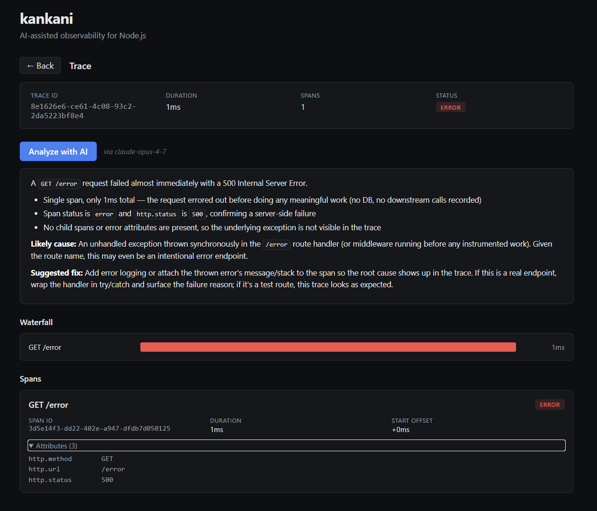

# kankani

> AI-assisted observability for Node.js

`kankani` (கண்காணி, Tamil for "to observe") is a small observability library for Node.js Express applications. One line of middleware gives you a local dashboard of HTTP request traces, plus an "Analyze" button that asks Claude to make sense of any trace on demand.

This is a focused v0.1 — capture, dashboard, AI explanation. No persistence, no auto-instrumentation, no remote backend. See [DESIGN.md](DESIGN.md) for the full plan and rationale.

## Install

```bash
npm install @natapillai/kankani
```

Requires Node.js `^20.19.0 || ^22.13.0 || >=24.0.0` and Express `^4 || ^5`.

## Quick start

```ts
import express from 'express';
import { kankani } from '@natapillai/kankani';

const k = await kankani();

const app = express();
app.use(k.middleware);

app.get('/', (_req, res) => res.send('hello'));
app.listen(3000);
```

That's it. While your app runs:

- Hit any route on `:3000` to capture traces.
- Open **http://127.0.0.1:9100** for the kankani dashboard.

The example uses top-level `await`, which requires the entry file to be ESM (set `"type": "module"` in your `package.json` or wrap the body in an async function).

## Screenshot



## What you get

Three layers, all running in your app's process:

1. **Capture.** An Express middleware records one span per HTTP request — method, path, status, duration. A `trace()` helper lets you wrap any async operation as a sub-span.
2. **Dashboard.** A local HTTP server on `:9100` (configurable) serves a React UI: a trace list, a per-trace waterfall, and an attribute-level span detail. Same-origin JSON API at `/api/traces` and `/api/traces/:id`.
3. **AI analysis.** Click "Analyze with AI" on any trace. kankani builds a structured prompt from the span data and asks Claude to summarize what happened, flag concerns, and suggest fixes. The response is rendered as markdown right in the dashboard.

## AI features

The Analyze endpoint is **opt-in**. Without a key, capture and the dashboard work fully — only the Analyze button is disabled (with a hint pointing you at the env var).

To enable AI:

```bash
export ANTHROPIC_API_KEY=sk-ant-...
```

Or pass it explicitly:

```ts
const k = await kankani({ anthropicApiKey: process.env.MY_ANTHROPIC_KEY });
```

The default model is `claude-opus-4-7`. Override for cost or latency:

```ts
const k = await kankani({ model: 'claude-haiku-4-5' });
```

**Cost expectation.** Each Analyze click is one Anthropic API request with adaptive thinking. Opus 4.7 runs ~$0.05–0.30 per click for typical traces; Haiku 4.5 is roughly 10× cheaper and still produces useful analyses. Set the model that fits your budget.

The API key stays server-side — the browser never sees it, even when the dashboard is bound to a non-local interface.

## API

```ts
import {
  kankani,           // top-level orchestrator
  SpanStore,         // in-memory bounded span store
  expressMiddleware, // HTTP capture middleware (used by kankani() internally)
  trace,             // wrap an async function as a span
  type Span,
  type Trace,
} from '@natapillai/kankani';
```

### `kankani(options?)`

```ts
interface KankaniOptions {
  port?: number;              // default 9100; use 0 for an OS-assigned port
  host?: string;              // default '127.0.0.1'
  token?: string;             // required when host is non-local
  maxTraces?: number;         // default 1000
  anthropicApiKey?: string;   // defaults to process.env.ANTHROPIC_API_KEY
  anthropicClient?: AnalysisClient; // pre-built Anthropic SDK client (precedence over the key)
  model?: string;             // default 'claude-opus-4-7'
}

interface Kankani {
  middleware: RequestHandler;
  store: SpanStore;
  url: string;     // dashboard URL, e.g. 'http://127.0.0.1:9100'
  stop(): Promise<void>;
}
```

### `trace(store, name, fn, options?)`

Wrap an async operation. The returned promise resolves or rejects the same way `fn` does; either way, a span lands in the store with the right status.

```ts
import { trace } from '@natapillai/kankani';

await trace(k.store, 'db.query', async () => {
  return await db.users.findById(id);
}, { attributes: { 'db.table': 'users' } });
```

For v0.1, `trace()` takes the store as an explicit argument and does not auto-link to a request span via `AsyncLocalStorage`. If you want a child span explicitly nested under the request, pass the request span as `{ parentSpan }` (the request span isn't currently surfaced — see Limitations).

## Security defaults

- **Localhost-only by default.** The dashboard server binds to `127.0.0.1`. Nothing outside your machine can reach it.
- **Non-local binds require a token.** `kankani({ host: '0.0.0.0' })` throws on startup unless you also pass `token: '...'`. With a token configured, every `/api/*` request must include `Authorization: Bearer <token>`. The token is verified with `crypto.timingSafeEqual` to avoid timing-based comparison leaks.
- **API key is server-side only.** The dashboard UI talks to the kankani server over your existing network path; the kankani server talks to Anthropic. The key never enters the browser.

## v0.1 limitations

Honest about what's not in scope yet:

- **Express only.** Peer dependency is `express ^4 || ^5`. Fastify/Koa/other-framework adapters are future work.
- **In-memory storage.** Traces are lost on restart. The `SpanStore` is bounded (default 1000 traces, oldest-first eviction).
- **No async-context propagation.** `trace()` doesn't automatically nest under the current HTTP request span. Manual nesting via `parentSpan` works; an `AsyncLocalStorage`-based ergonomic path is post-v0.1.
- **No auto-instrumentation.** Database calls, HTTP clients, and other libraries aren't wrapped automatically. Use `trace()` explicitly around the operations you want to see.
- **One Anthropic call per Analyze click.** No caching across clicks, no streaming response. Analyses take 5–15 seconds at adaptive thinking on Opus.

## Development

This repo is a pnpm workspace with two packages: the library at the root and the dashboard frontend in `dashboard/`.

```bash
pnpm install              # bootstrap the workspace
pnpm test                 # 52 unit tests, ~2s
pnpm typecheck            # tsc --noEmit on library + examples
pnpm lint                 # eslint on library + examples
pnpm build                # bundle the dashboard, compile TS, produce dist/
pnpm example              # run the example Express app on :3000 + dashboard on :9100
pnpm dashboard:dev        # Vite dev server on :5173 with hot reload
```

The dashboard build emits into `dist/ui/`; the library's `package.json` `files` field ships both the compiled JS and the bundled UI in one tree.

For local AI testing, drop your key into a gitignored `.env` at the repo root:

```
ANTHROPIC_API_KEY=sk-ant-...
```

`pnpm example` loads it automatically via Node's `--env-file=.env`.

## License

MIT — see [LICENSE](LICENSE).
